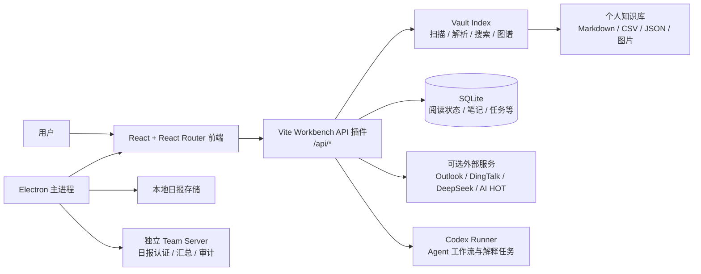

# Personal AI Workbench 技术架构

> 分析对象：`person_dashboard/Workbench` 及其旁边的 `个人知识库` Demo Vault  
> 分析时间：2026-08-13  
> 结论来源：项目源码、`package.json`、`vite.config.mjs`、测试目录和现有文档。本文描述当前工作区中的实现，不代表未来规划。

## 1. 架构摘要

Personal AI Workbench 是一个“本地优先、Vault 驱动、Agent 可调用”的个人知识与工作管理台。它将 Markdown/CSV/JSON 等文件作为主要内容来源，由 Node.js 运行时扫描和建立索引，React 前端负责浏览、搜索、阅读和可视化；需要持久化的本地交互状态放在 SQLite 或 Electron 本地存储中。



核心判断：它不是典型的前后端分离项目，而是以 Vite 开发服务器为宿主、由自定义插件同时承载前端开发和本地 API 的一体化应用。生产构建后，前端静态产物可用于 hosted/site 场景；桌面版通过 Electron 加载同一套前端，并额外暴露受控 IPC 能力。

## 2. 运行时与部署形态

### 2.1 本地 Web 开发模式

`Workbench/package.json` 的 `dev` 脚本并行启动两个进程：

- Vite 前端开发服务器，默认绑定 `127.0.0.1:5174`。
- `team-server`，默认用于团队日报相关接口，端口取决于环境配置，代码入口为 `team-server/server.mjs`。

`vite.config.mjs` 注册了 `workbenchApiPlugin()`。该插件通过 `configureServer()` 拦截 `/api/*` 请求，因此本地页面、Vault API 和大部分业务逻辑共享同一个 loopback 服务。

### 2.2 Electron 桌面模式

`electron/main.mjs` 创建安全配置的 `BrowserWindow`：启用 `contextIsolation`、关闭 `nodeIntegration`、启用 sandbox，并通过 `preload.mjs` 只暴露日报相关 IPC 方法。Electron 主进程还负责：

- 在用户数据目录维护本地日报草稿和待同步数据。
- 使用 Bearer Token 调用独立 Team Server。
- 定时同步待提交日报。
- 提供系统托盘入口。

因此 Electron 不是另一套业务前端，而是本地 Web Workbench 的桌面容器，加上一层本地离线日报能力。

### 2.3 Hosted / Worker 形态

`worker/index.js` 采用 Cloudflare Worker 风格的静态资源转发：普通请求交给 `env.ASSETS`，根路径 fallback 到 `index.html`。`Workbench/.openai/hosting.json` 当前没有配置 D1/R2 绑定，说明仓库本身更偏向静态/托管前端展示，完整本地 Vault 能力仍依赖本地 Node 运行时。

## 3. 代码分层

```text
Workbench/
├─ src/                 React 应用、页面、组件、前端状态与展示逻辑
│  ├─ pages/            路由级页面
│  ├─ components/       AppShell、抽屉、图谱、阅读器、领域组件
│  ├─ lib/              API 客户端、Markdown、阅读器、图谱等纯前端逻辑
│  ├─ graph/            知识图谱模型、布局、渲染、命中测试与动效
│  └─ hooks/            Vault 同步等 React Hooks
├─ server/              Vite 内置 API、Vault 索引、领域服务和安全校验
├─ shared/              前后端共享的数据契约、AI 摘要与 Token 工具
├─ team-server/         独立团队日报 HTTP 服务与 MySQL schema
├─ electron/            Electron 主进程、preload 和本地日报存储
├─ worker/              静态托管 Worker 入口
├─ scripts/             构建、测试编排、隐私扫描、Demo 数据生成
├─ tests/               Node 内置 test runner 测试
└─ public/、docs/       静态资源与项目文档
```

前端路由集中在 `src/App.jsx`，当前页面覆盖 Overview、Wiki、Materials、Books、Graph、Daily Hot、Social Insights、Douyin、任务/周重点/会议/日报、Outlook 和系统页等。跨页面的文档打开、搜索面板、阅读抽屉和 Vault revision 由 App 层统一协调。

## 4. 数据架构

### 4.1 Vault：内容事实源

默认 Vault 是项目旁边的 `个人知识库`；也可以通过 `PERSONAL_DASHBOARD_VAULT_ROOT` 指向仓库外的真实 Vault。`server/vault-index.mjs` 负责递归扫描、排除目录、解析 Markdown frontmatter、识别书籍/材料/Wiki/社媒数据，并构造文档索引。

Vault 的设计重点是“文件可读、来源可追溯”：

- Raw、Wiki、书籍、脚本、社媒报告和账户数据以目录及文件契约组织。
- `searchIndex()` 为搜索和集合页提供统一入口。
- 文档通过稳定 ID/相对路径在前端、阅读器和图谱之间传递。
- 图片读取先经过允许根目录和路径校验，避免任意文件读取。
- `PUBLIC_HIDDEN_PATH_PREFIXES` 等规则将私有工作流目录排除在公开构建、搜索和最近项目之外。

### 4.2 SQLite：本地交互状态

`vite-plugin-workbench.mjs` 将 `.local/workbench.sqlite` 作为默认本地数据库路径，并在服务端组合阅读笔记、阅读解释、材料阅读状态、任务和周重点等服务。它保存的是“应用状态”和派生交互数据，不取代 Vault 的内容存储职责。

### 4.3 Team Server：团队日报数据

`team-server/schema.sql` 使用 MySQL/InnoDB，主要实体包括：

- `users`：钉钉用户、部门、角色和状态。
- `dingtalk_tokens`：加密后的 Token。
- `daily_reports`：按用户和日期唯一的日报。
- `audit_logs`：管理操作审计。

Team Server 与本地 Workbench 的边界是 HTTP API；Electron 本地保存草稿，登录后将待同步日报提交到 Team Server。

### 4.4 外部集成与派生数据

当前代码中存在以下可选数据通道：

- Outlook：OAuth、同步、待办分类和归档，模型配置可使用 DeepSeek。
- DingTalk：OAuth、事件/日历与待办同步，以及团队日报认证。
- AI HOT：通过 `shared/ai-hot.mjs` 读取公开热点数据。
- Codex Runner：启动/取消/确认 Agent 工作流，支持 SSE 事件订阅。
- Douyin / Social Insights：主要读取 Vault 中已经整理好的脱敏或 synthetic 数据，不在 Workbench 内直接抓取平台数据。

## 5. 请求与数据流

### 5.1 普通知识浏览

```text
页面组件
  → src/lib/api.js
  → fetch('/api/...')
  → vite-plugin-workbench.mjs
  → vault-index / domain service
  → Vault 或 SQLite
  → JSON 响应
  → 页面渲染
```

`src/lib/api.js` 统一处理超时、HTTP 错误和 fallback。部分读取型页面在 API 不可用时返回 `src/data/fallback.js` 中的安全演示数据；这使 UI 可以展示空服务状态，但不应被理解为真实业务数据。

### 5.2 Vault 热更新

`useVaultSync.js` 订阅 `/api/vault/events` 的 `EventSource`，服务端发现 Vault 变化后递增 revision。App 使用 revision 参与路由渲染 key，使集合页、图谱和相关页面能够重新读取索引。

### 5.3 阅读器与 Agent 解释

阅读器先从文档 API 获取正文，再通过 reader 相关服务维护锚点、笔记和解释线程。解释任务可以由服务端调用 Codex Runner；结果可继续追问，或保存为阅读笔记。Wiki ingest 和 XHS workflow 采用 job 模型，并以状态查询或 SSE 向前端报告进度。

### 5.4 工作管理与日报

任务、周重点和 AI 周报通过本地 `/api/tasks`、`/api/weekly-focus` 和 `/api/weekly-report/ai-summary` 接口工作。日报在本地模式优先走 Electron IPC；在线/团队模式则通过 Team Server 的认证和日报接口完成同步。

## 6. API 能力分组

API 路由目前集中在 `server/vite-plugin-workbench.mjs`，主要可分为：

| 分组 | 典型接口 | 主要后端模块 |
| --- | --- | --- |
| Vault 与搜索 | `/api/overview`、`/api/collections/*`、`/api/search`、`/api/documents/*` | `vault-index.mjs` |
| 阅读器 | `/api/reader-notes`、`/api/reader-explanations` | `reader-notes.mjs`、`reader-explanations.mjs` |
| Wiki 工作流 | `/api/wiki-ingest`、`/api/wiki-ingest/jobs/*` | `wiki-ingest-runner.mjs` |
| 图谱与内容 | `/api/graph`、`/api/materials`、`/api/books` | `vault-index.mjs`、`materials.mjs`、`books.mjs` |
| 本地工作管理 | `/api/tasks`、`/api/weekly-focus` | `tasks.mjs`、`weekly-focus.mjs` |
| 外部集成 | `/api/outlook/*`、`/api/dingtalk/*`、`/api/integrations/*` | `outlook.mjs`、`dingtalk.mjs` |
| 社媒与日报 | `/api/douyin/works`、`/api/social-insights`、`/api/daily-report` | 对应领域服务和 Vault 契约 |
| 运行时与文件 | `/api/runtime`、`/api/refresh`、`/api/open` | 插件内运行时适配 |
| Agent 工作流 | `/api/reader-explanations`、`/api/workflows/*` | `codex-runner.mjs`、领域 runner |

## 7. 安全与隐私边界

项目的安全策略主要依赖“默认本地、显式连接、白名单读取”：

- 开发服务器默认只绑定 loopback。
- 真实 Vault 应放在公开 Git 仓库之外，通过环境变量连接。
- 前端读取文件时使用文档索引 ID，服务端再校验相对路径、允许根目录和文件大小。
- Markdown 渲染引入 `rehype-sanitize`，降低原始 HTML 风险。
- Electron 使用 context isolation、sandbox 和最小化 preload API。
- OAuth Token 在本地/团队服务中不直接暴露给前端；团队 schema 对 Token 使用 ciphertext 字段。
- 仓库自带 `privacy:scan`，用于发布前扫描真实个人数据、凭据、导出文件和本地路径。
- Demo Vault 与 Douyin/社媒示例应保持 synthetic；真实账号数据和真实知识库不应提交到公开仓库。

需要特别注意：`Workbench/.env`、`.local/workbench.sqlite*`、外部 Vault 和已生成的 `dist/` 可能包含本机状态或派生数据。发布前应以隐私扫描结果和 `.gitignore` 为准，不应仅凭文件名判断安全。

## 8. 构建、测试与发布链路

```text
npm run build
  → scripts/build.mjs
  → Vite 构建 dist/client
  → 生成/整理 dist/server 等托管产物

npm test
  → npm run build
  → scripts/test.mjs
  → Node --test 执行 tests/*.test.mjs

npm run privacy:scan
  → 扫描仓库及旁边 Demo Vault 的敏感内容边界
```

测试按领域拆分，当前可以看到图谱、阅读器、材料/书籍、社媒、日报、钉钉、Outlook、工作管理、Vault 同步、Wiki ingest、站点 Worker 和隐私边界等测试。典型变更应至少运行对应领域测试，发布前运行 `npm test`、`npm run build` 和 `npm run privacy:scan`。

## 9. 架构优点与维护关注点

### 优点

1. Vault 与 UI 解耦：Markdown 仍可被 Obsidian 或其他工具直接使用。
2. 本地优先降低隐私暴露面，外部集成是可选的。
3. 前端 API 客户端有 fallback 和统一错误处理，演示环境不依赖所有外部服务。
4. 阅读器、图谱、社媒和工作管理已经按领域拆出服务/测试，便于逐步演进。
5. Web、Electron 和 hosted 形态共享前端，产品能力可复用。

### 维护关注点

1. `vite-plugin-workbench.mjs` 集中了大量路由和依赖，已经是主要的复杂度中心；继续扩展时宜将路由处理拆到领域 router 或 service adapter。
2. Vault 的目录、frontmatter 和 CSV/JSON 字段是隐式 API；修改契约时应同步更新索引、页面 fallback、文档和测试。
3. “本地 SQLite 状态”和“Vault 内容事实源”必须保持职责边界，避免把同一事实写入两处后产生不一致。
4. Hosted/Worker 形态不能自然获得本地 Vault 和 Node API；部署文档应明确哪些页面是静态可用、哪些页面需要本地运行时。
5. 外部 OAuth、AI 模型调用和平台导出都属于高变依赖，应该保留配置缺失、超时、限流和数据不完整时的显式状态，而不是用 0 或虚构数据补齐。

## 10. 推荐的阅读顺序

新维护者可以按以下顺序理解项目：

1. `README.md`、`AGENTS.md`：项目目标、数据边界和开发约定。
2. `package.json`、`vite.config.mjs`：启动脚本、依赖和运行时接线。
3. `src/App.jsx`、`src/lib/api.js`：路由、页面边界和 API 调用方式。
4. `server/vite-plugin-workbench.mjs`：API 路由总入口与服务组合。
5. `server/vault-index.mjs`：Vault 扫描、索引和领域数据契约。
6. `server/codex-runner.mjs`、`server/wiki-ingest-runner.mjs`：Agent/异步工作流。
7. `electron/`、`team-server/`、`worker/`：桌面、团队和托管形态。
8. `tests/` 与 `docs/vault-data-contracts.md`：行为约束和数据契约。

## 11. 一句话结论

这是一个以本地 Markdown Vault 为事实源、以 Vite 自定义 API 插件为应用后端、以 React 为交互层、以 SQLite/Electron/Team Server 承载不同状态与协作场景的模块化个人工作台；它的核心工程风险不在单个 UI 页面，而在 Vault 数据契约、集中式 API 插件和多运行时边界的长期一致性。
