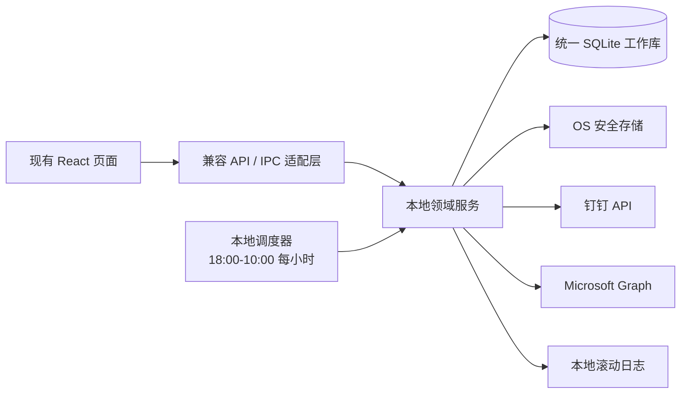

# 本地优先工作台：架构与数据模型重构方案

> 状态：**已按本方案落地实施**。独立 `team-server` 进程与 MySQL 已移除，团队日报、组织关系、审计等数据全部收敛到本地 SQLite（`server/` 本地服务与 `/api/local-team/*`、`/api/local-daily-reports/*` 接口）。下方保留设计过程供追溯；当前实现以代码为准。
> 目标：在**不调整现有 React 页面和路由**的前提下，将工作管理、日报、团队洞察与外部同步逐步收敛到一个本地 SQLite 数据库。

> **产品方向声明**：本项目为**本地优先的个人工作管理平台**（对接钉钉与 Outlook 数据、LLM 数据分析、数据完全本地、多用户隔离）。**Markdown 知识库（Vault）模块暂不开发、不对用户开放**，社媒洞察、抖音数据等 Vault 内容展示模块同样不对用户开放。本方案聚焦工作管理数据收敛，符合该方向。

## 1. 决策摘要

现状（已按目标架构收敛）：原运行时存在本地 `.local/workbench.sqlite`、Electron 用户目录中的日报 SQLite、加密 JSON 状态文件，以及 MySQL `team-server`，会造成离线数据分裂和同步语义不一致；现已统一为单一本地 SQLite 工作库。

目标架构采用以下原则：

- 一个用户配置目录内仅维护一个业务 SQLite 数据库；Vault 仅作演示数据保留，不搬入 SQLite。
- Electron Main Process（开发模式由 Node 本地服务适配）是唯一的外部同步与定时任务宿主。
- Outlook、钉钉凭据使用操作系统安全存储；SQLite 只保存凭据引用和到期元数据。
- 当前页面、路由、前端接口名称保持不变；先在服务层做兼容适配，再逐步替换内部表与实现。
- `team-server`/MySQL 已不再作为运行依赖（已移除）；不重新引入。



## 2. 兼容边界

本阶段不修改 `src/pages/`、导航、路由或组件交互。以下现有接口继续有效：

- `/api/tasks`：内部由 `work_items(kind='task')` 适配返回；旧 `open/completed` 映射到新状态。
- `/api/weekly-focus`：内部由 `goals` 与 `goal_work_items` 适配返回。
- `/api/daily-report` 与 Electron `daily-report:*` IPC：内部由统一 `daily_reports` 适配。
- `/api/outlook/*`、`/api/dingtalk/*`：保持调用契约，凭据和同步状态改为统一存储。
- 团队日报页面继续读取现有返回结构；后端将本地的组织、日报、问题和反馈聚合为同一 DTO。

因此，表结构迁移可独立验收，不会引入页面重做风险。

## 3. SQLite 设计约定

- 所有时间存储为 UTC ISO-8601 `TEXT`；日报日期和调度窗口按 `Asia/Shanghai` 计算。
- 主键使用应用生成的 UUID `TEXT`，避免离线写入时依赖自增 ID。
- `*_json` 字段只放可演进的非查询结构；高频筛选字段必须单列并建立索引。
- 原始邮件正文、钉钉完整响应、Token 均不放主业务表。必要时使用加密归档文件或安全存储引用。
- 数据库连接初始化必须执行：`PRAGMA journal_mode=WAL; PRAGMA foreign_keys=ON; PRAGMA busy_timeout=5000;`。
- 每个表和字段在 DDL 前使用 SQLite 兼容的 `--` 注释说明；SQLite 本身不支持 `COMMENT ON` 或列级 `COMMENT` 语法。

## 4. 目标建表语句

> 推荐新增 `server/db/migrations/001_local_first_core.sql`。执行前先创建数据库备份；迁移通过 `schema_migrations` 幂等管理。

```sql
-- 表：schema_migrations
-- 用途：记录本地数据库迁移版本，防止同一迁移重复执行。
CREATE TABLE IF NOT EXISTS schema_migrations (
  version TEXT PRIMARY KEY,                 -- 迁移唯一版本号，例如 001_local_first_core
  applied_at TEXT NOT NULL                  -- 迁移成功执行的 UTC 时间
);

-- 表：identities
-- 用途：统一表示本地用户及外部平台账户身份；不保存访问令牌。
CREATE TABLE IF NOT EXISTS identities (
  id TEXT PRIMARY KEY,                      -- 本地 UUID
  provider TEXT NOT NULL,                   -- 身份来源：local / dingtalk / outlook
  provider_account_id TEXT NOT NULL,        -- 外部平台账户唯一 ID；local 身份使用本地稳定 ID
  display_name TEXT,                        -- 展示名称
  email TEXT,                               -- 邮箱地址（可为空）
  avatar_url TEXT,                          -- 头像地址（可为空）
  profile_json TEXT,                        -- 非核心身份扩展信息，禁止写入 token
  last_synced_at TEXT,                      -- 最近一次从外部平台更新身份的时间
  created_at TEXT NOT NULL,                 -- 创建时间
  updated_at TEXT NOT NULL,                 -- 最后更新时间
  UNIQUE(provider, provider_account_id)
);

-- 表：departments
-- 用途：保存可选的组织部门树，供主管范围、团队统计和筛选使用。
CREATE TABLE IF NOT EXISTS departments (
  id TEXT PRIMARY KEY,                      -- 本地 UUID 或外部稳定 ID
  provider_id TEXT,                         -- 外部平台部门 ID
  name TEXT NOT NULL,                       -- 部门名称
  parent_id TEXT REFERENCES departments(id),-- 上级部门；根部门为空
  updated_at TEXT NOT NULL,                 -- 最近同步或修改时间
  UNIQUE(provider_id)
);

-- 表：org_members
-- 用途：维护身份的组织关系与权限；直接主管关系用于团队日报可见范围。
CREATE TABLE IF NOT EXISTS org_members (
  identity_id TEXT PRIMARY KEY REFERENCES identities(id),
                                            -- 成员身份 ID
  manager_identity_id TEXT REFERENCES identities(id),
                                            -- 直接主管身份 ID，可为空
  department_id TEXT REFERENCES departments(id),
                                            -- 所属部门，可为空
  role TEXT NOT NULL DEFAULT 'member'
    CHECK (role IN ('member', 'manager', 'admin')),
                                            -- 角色：成员 / 主管 / 管理员
  status TEXT NOT NULL DEFAULT 'active'
    CHECK (status IN ('active', 'disabled')),
                                            -- 账号是否可参与同步与展示
  updated_at TEXT NOT NULL                  -- 最后更新时间
);
CREATE INDEX IF NOT EXISTS idx_org_members_manager
  ON org_members(manager_identity_id);      -- 主管查看直属下属的高频索引

-- 表：secret_refs
-- 用途：只保存凭据在操作系统安全存储中的引用；禁止保存明文或密文 token。
CREATE TABLE IF NOT EXISTS secret_refs (
  id TEXT PRIMARY KEY,                      -- 本地 UUID
  provider TEXT NOT NULL,                   -- outlook / dingtalk / dingtalk_app 等
  subject_id TEXT NOT NULL,                 -- 身份 ID 或应用作用域标识
  keychain_key TEXT NOT NULL UNIQUE,         -- safeStorage / Keychain / DPAPI 的定位键
  expires_at TEXT,                          -- access token 到期时间，仅用于刷新判断
  rotated_at TEXT,                          -- 最近轮换凭据时间
  created_at TEXT NOT NULL,                 -- 创建时间
  updated_at TEXT NOT NULL,                 -- 最后更新时间
  UNIQUE(provider, subject_id)
);

-- 表：work_items
-- 用途：统一承载手工任务、邮件行动项、会议行动项和日报行动项，是 Today 的唯一行动数据源。
CREATE TABLE IF NOT EXISTS work_items (
  id TEXT PRIMARY KEY,                      -- 本地 UUID
  kind TEXT NOT NULL CHECK (kind IN ('task', 'email_action', 'meeting_action', 'report_action')),
                                            -- 工作项类型
  title TEXT NOT NULL,                      -- 标题，建议业务层限制为 200 字符
  description TEXT,                         -- 备注或行动说明，禁止直接写入完整邮件正文
  status TEXT NOT NULL DEFAULT 'inbox'
    CHECK (status IN ('inbox', 'planned', 'in_progress', 'blocked', 'done', 'cancelled')),
                                            -- 生命周期状态
  priority TEXT NOT NULL DEFAULT 'P1'
    CHECK (priority IN ('P0', 'P1', 'P2')),
                                            -- 优先级
  due_at TEXT,                              -- 截止时间，可为空
  scheduled_for TEXT,                       -- 计划执行日，格式 YYYY-MM-DD，用于 Today 查询
  completed_at TEXT,                        -- 完成时间
  cancelled_at TEXT,                        -- 取消时间
  owner_identity_id TEXT REFERENCES identities(id),
                                            -- 工作项负责人；个人版通常是当前用户
  source_type TEXT,                         -- 来源类型：local / outlook / dingtalk / manual
  source_external_id TEXT,                  -- 来源系统中的稳定唯一 ID
  source_url TEXT,                          -- 回源链接或应用内定位 URL
  source_snapshot_json TEXT,                -- 脱敏摘要，例如邮件主题、发送人、外部更新时间
  created_at TEXT NOT NULL,                 -- 创建时间
  updated_at TEXT NOT NULL,                 -- 最后更新时间
  UNIQUE(source_type, source_external_id)
);
CREATE INDEX IF NOT EXISTS idx_work_items_today
  ON work_items(owner_identity_id, status, scheduled_for, due_at);
                                            -- Today 的主查询索引
CREATE INDEX IF NOT EXISTS idx_work_items_active_due
  ON work_items(status, due_at)
  WHERE status IN ('inbox', 'planned', 'in_progress', 'blocked');
                                            -- 逾期与待处理项索引

-- 表：work_item_events
-- 用途：保存任务状态变化、延期、阻塞和完成事件，为日报和复盘提供可追溯事实。
CREATE TABLE IF NOT EXISTS work_item_events (
  id TEXT PRIMARY KEY,                      -- 本地 UUID
  work_item_id TEXT NOT NULL REFERENCES work_items(id) ON DELETE CASCADE,
                                            -- 所属工作项
  event_type TEXT NOT NULL,                 -- created / planned / started / blocked / completed / rescheduled 等
  from_status TEXT,                         -- 变更前状态
  to_status TEXT,                           -- 变更后状态
  payload_json TEXT,                        -- 延期原因、阻塞原因等扩展信息
  occurred_at TEXT NOT NULL                 -- 事件发生时间
);
CREATE INDEX IF NOT EXISTS idx_work_item_events_item_time
  ON work_item_events(work_item_id, occurred_at DESC);
                                            -- 查看工作项历史的索引

-- 表：goals
-- 用途：替代现有 weekly_focus，表达某周目标与手工进度。
CREATE TABLE IF NOT EXISTS goals (
  id TEXT PRIMARY KEY,                      -- 本地 UUID
  period_type TEXT NOT NULL DEFAULT 'week' CHECK (period_type IN ('week')),
                                            -- 当前只支持周目标，预留扩展
  period_start TEXT NOT NULL,               -- 周开始日期，YYYY-MM-DD
  period_end TEXT NOT NULL,                 -- 周结束日期，YYYY-MM-DD
  title TEXT NOT NULL,                      -- 目标标题
  detail TEXT,                              -- 目标说明
  manual_progress INTEGER NOT NULL DEFAULT 0 CHECK (manual_progress BETWEEN 0 AND 100),
                                            -- 用户手工填写进度
  next_step TEXT,                           -- 下一步行动
  status TEXT NOT NULL DEFAULT 'active' CHECK (status IN ('active', 'completed', 'cancelled')),
                                            -- 目标状态
  created_at TEXT NOT NULL,                 -- 创建时间
  updated_at TEXT NOT NULL                  -- 最后更新时间
);
CREATE INDEX IF NOT EXISTS idx_goals_period
  ON goals(period_start, created_at);       -- 按周读取目标的索引

-- 表：goal_work_items
-- 用途：建立周目标和工作项之间的多对多关系，用于计算自动进度。
CREATE TABLE IF NOT EXISTS goal_work_items (
  goal_id TEXT NOT NULL REFERENCES goals(id) ON DELETE CASCADE,
                                            -- 周目标 ID
  work_item_id TEXT NOT NULL REFERENCES work_items(id) ON DELETE CASCADE,
                                            -- 关联工作项 ID
  created_at TEXT NOT NULL,                 -- 建立关联时间
  PRIMARY KEY(goal_id, work_item_id)
);

-- 表：daily_reports
-- 用途：个人日报草稿、手工提交和钉钉同步结果的统一事实表。
CREATE TABLE IF NOT EXISTS daily_reports (
  id TEXT PRIMARY KEY,                      -- 本地 UUID
  owner_identity_id TEXT NOT NULL REFERENCES identities(id),
                                            -- 日报所属成员
  report_date TEXT NOT NULL,                -- 日报业务日期，YYYY-MM-DD，按上海时区
  source TEXT NOT NULL CHECK (source IN ('manual', 'dingtalk')),
                                            -- 日报来源
  source_report_id TEXT,                    -- 钉钉日报稳定 ID；手工日报为空
  sync_status TEXT NOT NULL DEFAULT 'draft'
    CHECK (sync_status IN ('draft', 'pending_sync', 'synced', 'failed')),
                                            -- 本地草稿及外部同步状态
  summary TEXT,                             -- 日报摘要
  completed_snapshot_json TEXT NOT NULL DEFAULT '[]',
                                            -- 当日完成工作快照
  next_actions_snapshot_json TEXT NOT NULL DEFAULT '[]',
                                            -- 下一步行动快照
  raw_payload_ref TEXT,                     -- 加密原始响应归档引用，默认不暴露给 UI
  submitted_at TEXT,                        -- 用户提交时间
  synced_at TEXT,                           -- 最近同步成功时间
  source_updated_at TEXT,                   -- 外部源最近修改时间，用于覆盖判断
  created_at TEXT NOT NULL,                 -- 创建时间
  updated_at TEXT NOT NULL,                 -- 最后更新时间
  UNIQUE(owner_identity_id, report_date),
  UNIQUE(source, source_report_id)
);
CREATE INDEX IF NOT EXISTS idx_daily_reports_owner_date
  ON daily_reports(owner_identity_id, report_date DESC);
                                            -- 成员日报页与漏交判断的索引

-- 表：report_issues
-- 用途：将日报中的阻塞、风险、待决策和协作请求拆为可处理对象。
CREATE TABLE IF NOT EXISTS report_issues (
  id TEXT PRIMARY KEY,                      -- 本地 UUID
  report_id TEXT NOT NULL REFERENCES daily_reports(id) ON DELETE CASCADE,
                                            -- 来源日报 ID
  issue_type TEXT NOT NULL
    CHECK (issue_type IN ('blocker', 'risk', 'decision_needed', 'cooperation_needed')),
                                            -- 问题分类
  title TEXT NOT NULL,                      -- 问题标题
  detail TEXT,                              -- 详细说明
  severity TEXT NOT NULL DEFAULT 'medium'
    CHECK (severity IN ('low', 'medium', 'high', 'critical')),
                                            -- 严重程度
  status TEXT NOT NULL DEFAULT 'open'
    CHECK (status IN ('open', 'acknowledged', 'resolved', 'closed')),
                                            -- 处理状态
  assignee_identity_id TEXT REFERENCES identities(id),
                                            -- 负责处理者，通常为主管或协作者
  resolved_at TEXT,                         -- 解决时间
  created_at TEXT NOT NULL,                 -- 创建时间
  updated_at TEXT NOT NULL                  -- 最后更新时间
);
CREATE INDEX IF NOT EXISTS idx_report_issues_status
  ON report_issues(status, severity, created_at DESC);
                                            -- 主管例外优先视图的索引

-- 表：report_feedback
-- 用途：记录日报已读、催办、认可、评论与决策，确保主管反馈可回流给成员。
CREATE TABLE IF NOT EXISTS report_feedback (
  id TEXT PRIMARY KEY,                      -- 本地 UUID
  report_id TEXT NOT NULL REFERENCES daily_reports(id) ON DELETE CASCADE,
                                            -- 对应日报 ID
  issue_id TEXT REFERENCES report_issues(id) ON DELETE SET NULL,
                                            -- 可选：针对具体问题的反馈
  author_identity_id TEXT NOT NULL REFERENCES identities(id),
                                            -- 反馈发起人
  feedback_type TEXT NOT NULL
    CHECK (feedback_type IN ('read', 'decision', 'reminder', 'recognition', 'comment')),
                                            -- 反馈类别
  content TEXT,                             -- 决策、评论或催办内容；read 类型可为空
  created_at TEXT NOT NULL                  -- 创建时间
);
CREATE INDEX IF NOT EXISTS idx_report_feedback_report_time
  ON report_feedback(report_id, created_at DESC);
                                            -- 日报反馈状态读取索引

-- 表：sync_jobs
-- 用途：记录每次 Outlook/钉钉同步执行，支持失败诊断、重试和可观测性。
CREATE TABLE IF NOT EXISTS sync_jobs (
  id TEXT PRIMARY KEY,                      -- 本地 UUID
  provider TEXT NOT NULL,                   -- dingtalk_reports / dingtalk_calendar / outlook
  scope TEXT NOT NULL,                      -- self / team / mailbox
  status TEXT NOT NULL CHECK (status IN ('queued', 'running', 'succeeded', 'failed')),
                                            -- 作业状态
  cursor_json TEXT,                         -- 分页游标、日期范围等断点信息
  started_at TEXT,                          -- 开始时间
  finished_at TEXT,                         -- 结束时间
  next_run_at TEXT,                         -- 计划或重试时间
  error_code TEXT,                          -- 脱敏后的错误代码
  error_message TEXT,                       -- 脱敏后的错误摘要，不得包含 token 或正文
  metrics_json TEXT                         -- 拉取、写入、跳过数量等指标
);
CREATE INDEX IF NOT EXISTS idx_sync_jobs_pending
  ON sync_jobs(status, next_run_at);        -- 调度器查找待执行与重试作业的索引

-- 表：sync_checkpoints
-- 用途：保存每个外部数据域的最后成功游标和错误状态，避免全量重复拉取。
CREATE TABLE IF NOT EXISTS sync_checkpoints (
  provider TEXT NOT NULL,                   -- 外部提供方
  scope_key TEXT NOT NULL,                  -- 作用域，如 team / self:{identityId}
  cursor_json TEXT,                         -- 下次增量同步所需游标或时间边界
  last_success_at TEXT,                     -- 最近成功时间
  last_attempt_at TEXT,                     -- 最近尝试时间
  last_error_code TEXT,                     -- 最近失败代码
  PRIMARY KEY(provider, scope_key)
);

-- 表：notifications
-- 用途：存储应用内提醒；离线时仍可展示，联网后无需依赖远端推送。
CREATE TABLE IF NOT EXISTS notifications (
  id TEXT PRIMARY KEY,                      -- 本地 UUID
  recipient_identity_id TEXT NOT NULL REFERENCES identities(id),
                                            -- 接收者身份 ID
  type TEXT NOT NULL,                       -- report_missing / report_reminder / feedback_received 等
  payload_json TEXT NOT NULL,               -- 页面渲染所需的最小脱敏载荷
  read_at TEXT,                             -- 用户已读时间
  created_at TEXT NOT NULL                  -- 创建时间
);
CREATE INDEX IF NOT EXISTS idx_notifications_recipient_unread
  ON notifications(recipient_identity_id, read_at, created_at DESC);
                                            -- 首页读取未读提醒的索引

-- 表：audit_events
-- 用途：记录敏感操作和关键业务操作；不记录凭据、邮件正文或完整日报原文。
CREATE TABLE IF NOT EXISTS audit_events (
  id TEXT PRIMARY KEY,                      -- 本地 UUID
  actor_identity_id TEXT REFERENCES identities(id),
                                            -- 操作人；系统任务可为空
  action TEXT NOT NULL,                     -- 操作名称，如 report.read / sync.run / credential.rotate
  target_type TEXT NOT NULL,                -- 目标类别
  target_id TEXT,                           -- 目标 ID
  metadata_json TEXT,                       -- 最小化审计元数据，必须脱敏
  created_at TEXT NOT NULL                  -- 发生时间
);
CREATE INDEX IF NOT EXISTS idx_audit_events_created
  ON audit_events(created_at DESC);         -- 系统诊断与审计查询索引
```

## 5. 旧表迁移映射

> 本表为设计期迁移映射，已按此完成数据收敛；MySQL 表已不再存在（数据迁移至本地 SQLite）。

| 现有存储 | 迁移目标 | 规则 |
| --- | --- | --- |
| `tasks` | `work_items` | `open → planned`，`completed → done`；保留来源字段与完成时间。 |
| `task_completion_logs` | `work_item_events` | 生成 `completed` 事件；旧快照不覆盖新工作项内容。 |
| `weekly_focus` | `goals` | `progress → manual_progress`，`week_start/week_end → period_start/period_end`。 |
| `weekly_focus_tasks` | `goal_work_items` | 按关联关系无损迁移。 |
| Electron `daily_report_drafts` | `daily_reports` | `sync_status` 原样迁移；同一天重复记录按 `updated_at` 较新者保留。 |
| MySQL `users`（已移除） | `identities` + `org_members` | 钉钉 ID 是外部稳定 ID，经理关系迁为 `manager_identity_id`。 |
| MySQL `daily_reports`（已移除） | `daily_reports` + `report_issues` | 文本中的 blocker 等先保留原文；后续由用户或解析器增量拆分为 issue。 |
| MySQL `audit_logs`（已移除） | `audit_events` | 动作、目标和发生时间直接映射。 |

迁移流程：备份数据库 → 事务内执行新增表 → 批量迁移 → 对账记录数/唯一键冲突 → 写入 `schema_migrations`。在完成一轮真实数据验证前，不删除旧表或旧 JSON 文件。

## 6. 钉钉日报同步契约与调度

现有已验证接口约定见 [dingtalk-daily-report-sync.md](dingtalk-daily-report-sync.md)，应保留：

| 业务场景 | `/topapi/report/list` 查询日期 | 是否传 `userid` |
| --- | --- | --- |
| Today 导入昨日计划 | 昨天 | 是，当前用户钉钉 ID |
| 个人日报 | 所选日期，默认今天 | 是，当前用户钉钉 ID |
| 团队日报 | 所选日期 | 否，拉取团队数据 |

调度规则变更为：

1. 按 `Asia/Shanghai` 在每日 `18:00` 至次日 `10:00` 的每个整点创建 `dingtalk_reports/team` 作业。
2. 作业默认同步“昨天至今天”，通过 `source_report_id` 与 `(owner_identity_id, report_date)` 幂等 upsert。
3. 手动点击同步只创建高优先级作业，不让 React 页面直接持有或调用平台 token。
4. 同步失败写入 `sync_jobs`、`sync_checkpoints` 和本地滚动日志；页面显示最近成功时间及可理解错误。
5. 失败重试使用指数退避，最大不超过下一个正常整点；避免多个页面并发重复拉取。

钉钉接口、权限范围、请求字段或 IP 白名单规则变更时，实施人员必须先通过 Context7 或钉钉官方开发文档核验，再修改适配器和测试；设计文档不能替代实时接口文档。

## 7. 凭据与日志

- Electron 优先使用 `safeStorage` 存储 Outlook 和钉钉 refresh token；Windows 由 DPAPI 保护，macOS 由 Keychain 保护。
- `secret_refs.keychain_key` 只存查找键；数据库、前端状态、API 响应、日志中均不得出现 token。
- 若操作系统安全存储不可用，必须显式提示用户，并采用 AES-256-GCM 降级加密；主密钥与数据库分离保存。
- 日志使用按日滚动的 JSON Lines 文件，建议保留 30 天；记录作业 ID、provider、耗时、记录数、错误代码，不记录 Authorization、Token、邮件正文、日报原文。

## 8. 实施阶段

> 各阶段已按序完成（当前实现以代码为准）；独立 Team Server、MySQL 与 `TEAM_REPORT_API_URL` 均已移除。

1. **M0：数据库底座**：创建连接管理器、迁移器、备份机制和上述核心表；不改页面。
2. **M1：任务兼容适配**：`/api/tasks` 改由 `work_items` 支撑，兼容原响应字段并补齐测试。
3. **M2：日报统一**：将 Electron 日报草稿迁入统一库，保留现有 IPC 名称。
4. **M3：本地同步调度**：实现 18:00–10:00 小时作业、检查点、日志和设置页状态。
5. **M4：团队洞察数据化**：接入组织关系、`report_issues`、`report_feedback`；现有团队页面的 DTO 不变。
6. **M5：移除强依赖**：Electron 不再需要 `TEAM_REPORT_API_URL`、MySQL 或独立 Team Server 才可运行（已完成）。

每个阶段完成后至少运行对应领域测试、`npm test` 和 `npm run privacy:scan`。
